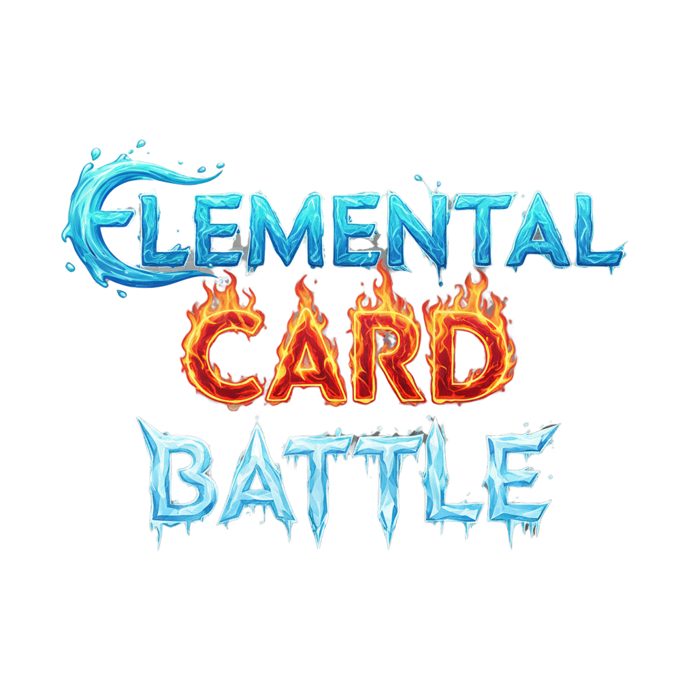

# Elemental Card Battle

  
Multiplayer elemental card game inspired by Club Penguin’s **Card Jitsu**.

---

## Overview

**Elemental Card Battle** is a multiplayer card game for two players. The project was inspired by the classic **Card Jitsu** from Club Penguin — a game I greatly enjoyed but which became unavailable after the servers were shut down.

This project is a simplified reinterpretation that preserves the core mechanics of Card Jitsu while adapting them to a fantasy setting. The game features elemental kings, ninjas, dragons, and other mythical creatures.

*Loosely inspired by [Card Jitsu](https://clubpenguin.fandom.com/wiki/Card-Jitsu) from Club Penguin.*

---

## Technologies

### Frontend
- Next.js 13 (App Router)
- TypeScript
- Tailwind CSS
- Zustand
- Framer Motion
- Three.js

### Backend
- Spring Boot (Java)
- STOMP + SockJS (WebSockets)
- PostgreSQL

### Others
- **Figma** – UI/UX design
- **Google Gemini** – AI-generated card graphics (consistent prompts)
---

## UI / Graphics

All card illustrations were generated using **Google Gemini** with consistent prompts to maintain a unified visual style.

---

## Current Features

- Create & join rooms
- Real-time chat in lobby
- Live notifications when players join or leave
- Smooth, WebSocket-powered gameplay
- Auto-cleaning of inactive rooms (ghost lobby prevention)
- Responsive UI for desktop & mobile

---

## Project Structure (High-Level)

frontend/
├── .next/             
├── api/                # API route handlers 
├── app/                # Main application pages and routing
├── components/         # Reusable UI components 
├── helpers/            # Utility functions
├── lib/                # Core WS client
├── public/             # Static assets (e.g., images, fonts, favicons)
├── store/              # State management
├── types/              # TypeScript type definitions and interfaces for type safety
├── .env.local          # Local environment variables (not committed to version control)
├── .gitignore          # Git ignore rules for excluding files/directories
├── next.config.ts      # Next.js configuration file
└── package.json        # Project dependencies, scripts, and metadata

com/elemental/card/battle/elemental/card/battle//
├── config/      # Configuration classes 
├── controller/  # REST API controllers 
├── dto/         # Data Transfer Objects for API payloads
├── manager/     # Business logic managers (lobbies, rooms, gamesession)
├── mapper/      # Object mappers
├── model/       # Domain models and entities 
├── repository/  # Data access repositories Spring Data JPA
├── service/     # Service layer for business logic and transactions
└── util/        # Utility classes, helper functions
---