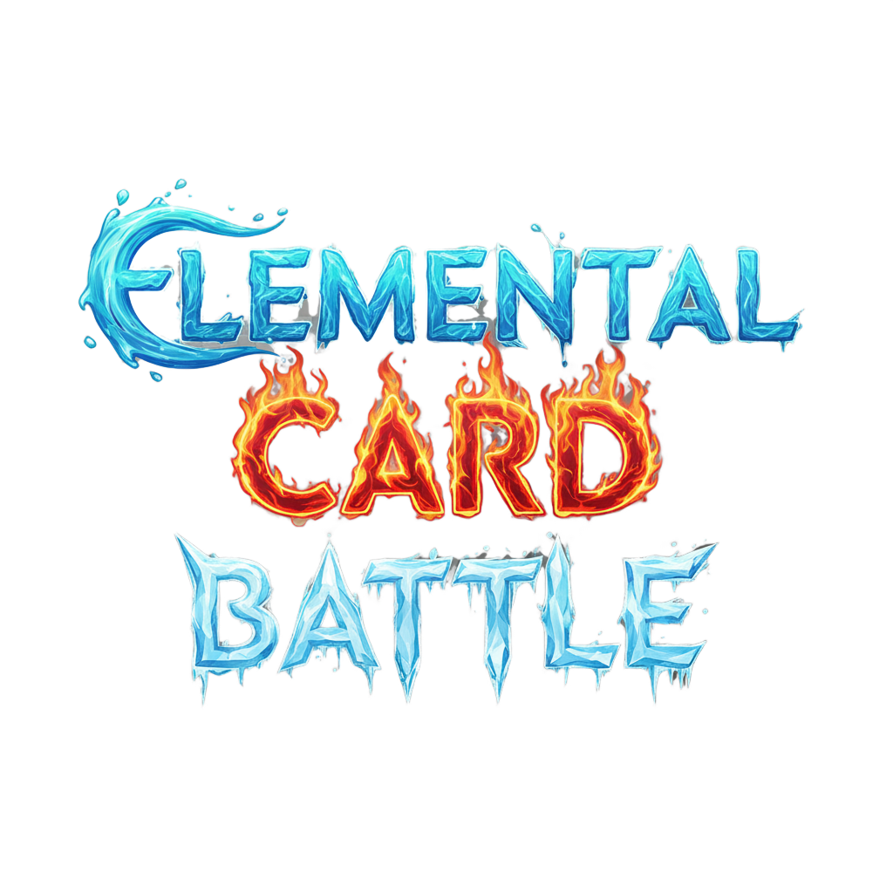
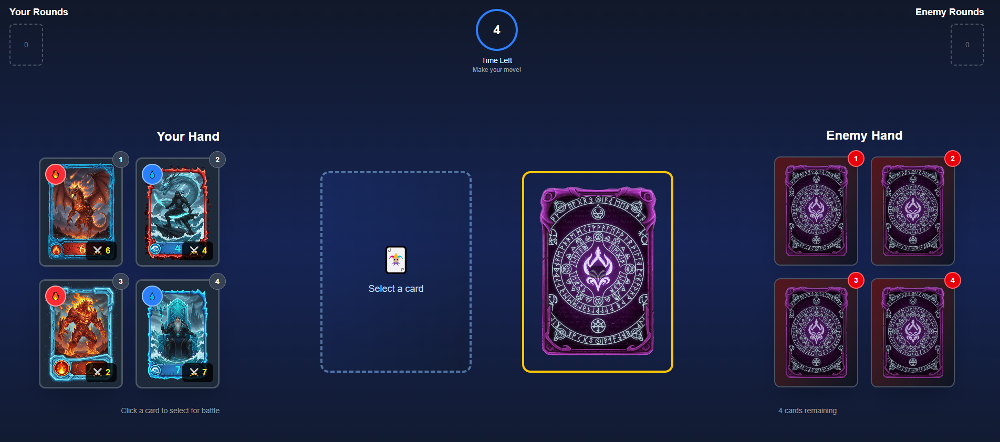
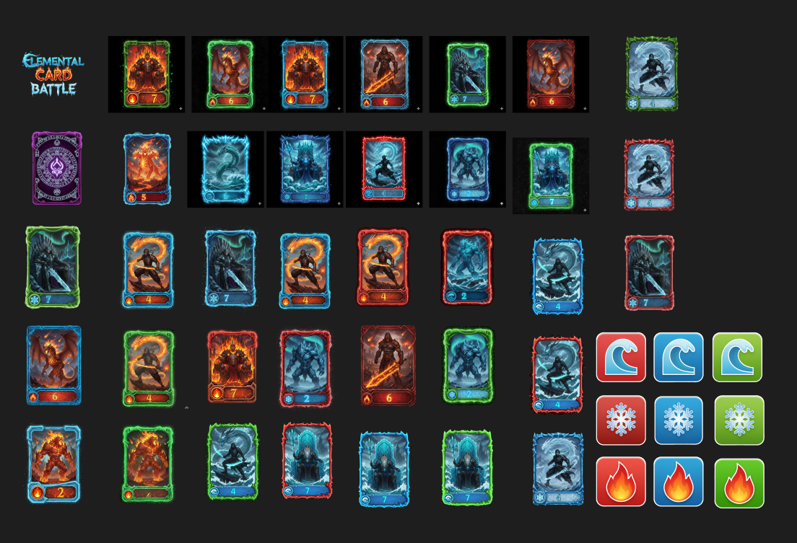

# Elemental Card Battle

<div align="center">
  
  
  ### Multiplayer elemental card game inspired by Club Penguin's Card Jitsu
  
  [](https://elemental-card-battle-ui.onrender.com)
  
  >**Note:** The application is hosted on Render's free tier, so initial loading may take up to 30 seconds as the server spins up from sleep mode.
</div>

## Overview

**Elemental Card Battle** is a real-time multiplayer card game for two players. Inspired by the beloved **Card Jitsu** from Club Penguin — a game I deeply enjoyed but which became inaccessible after the servers shut down — this project brings back the nostalgic gameplay with a fantasy twist.

This is a reimagined version that preserves the core rock-paper-scissors-style mechanics while introducing a magical world of elemental kings, ninjas, dragons, and other mythical creatures.

*Loosely inspired by [Card Jitsu](https://clubpenguin.fandom.com/wiki/Card-Jitsu) from Club Penguin.*

<div align="center">
  
</div>

---

## Technologies

### Frontend
- Next.js 13 (App Router)
- TypeScript
- Tailwind CSS
- Zustand
- Framer Motion
- Three.js
- STOMP + SockJS

### Backend
- Spring Boot (Java)
- STOMP + SockJS (WebSockets)
- PostgreSQL

### Others
- **Figma** – UI/UX design
- **Google Gemini** – AI-generated card graphics (consistent prompts)
---

## UI / Graphics

All card illustrations were generated using **Google Gemini** with consistent prompts to maintain a unified visual style.



---

## 📁 Project Structure
```
elemental-card-battle/
├── frontend/          # Next.js frontend application
├── backend/           # Spring Boot backend application
└─── docs/              # Documentation and screenshots
```

---

## Current Features

- Create & join rooms
- Real-time chat in lobby
- Live notifications when players join or leave
- Smooth, WebSocket-powered gameplay
- Auto-cleaning of inactive rooms (ghost lobby prevention)
- Responsive UI for desktop & mobile

---

<div align="center">
  ⭐ Star this repo if you enjoyed the game!
</div>